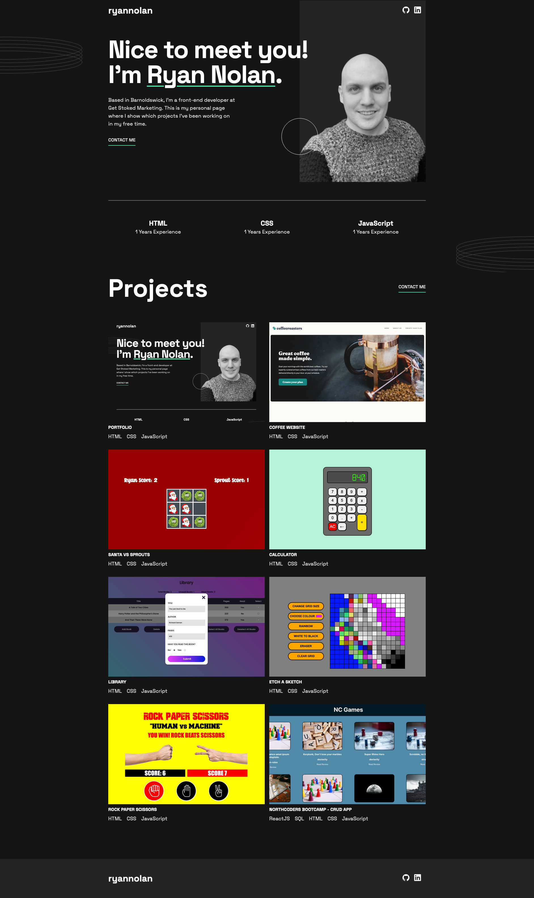

# Frontend Mentor - Single-page developer portfolio solution

This is a solution to the [Single-page developer portfolio challenge on Frontend Mentor](https://www.frontendmentor.io/challenges/singlepage-developer-portfolio-bBVj2ZPi-x). Frontend Mentor challenges help you improve your coding skills by building realistic projects. 

## Table of contents

- [Overview](#overview)
  - [Screenshot](#screenshot)
  - [Links](#links)
  - [Built with](#built-with)
- [Author](#author)

### Screenshot

### Links

- Solution URL: [https://ryannolan1.github.io/portfolio-2.0/](https://ryannolan1.github.io/portfolio-2.0/)
- Live Site URL: [https://github.com/RyanNolan1/portfolio-2.0](https://github.com/RyanNolan1/portfolio-2.0)

### Built with

- Semantic HTML5 markup
- CSS
- Flexbox
- CSS Grid

## Author

- Website - [Ryan Nolan](https://ryannolan1.github.io/portfolio-2.0/)
- LinkedIn - [ryan-nolan1](https://www.linkedin.com/in/ryan-nolan1/)
- GitHub - [https://github.com/RyanNolan1](https://github.com/RyanNolan1)
